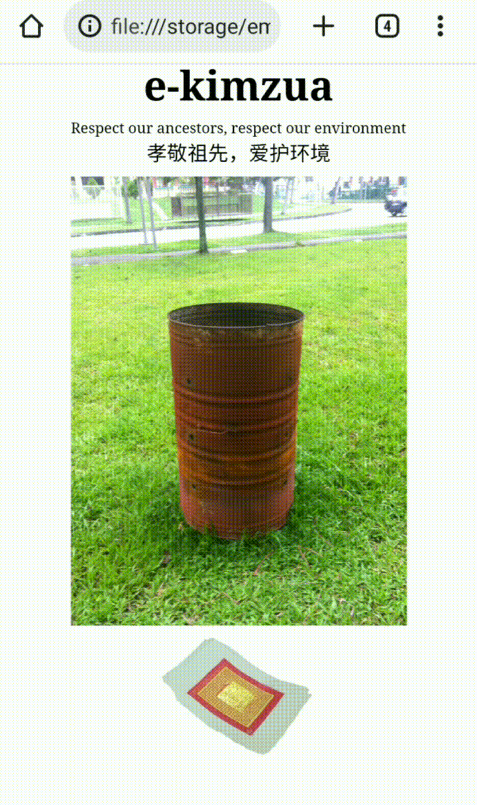

# e-kimzua

This simple webpage allows people to pay respects to their ancestors by burning joss paper virtually. 

## Assets

Image sources:
- Burner: [Original photo](https://heartlandertourist.files.wordpress.com/2013/08/img_8885.jpg) by [The Heartlander Tourist](https://heartlanderoverseas.wordpress.com/), with edits by me.
- Paper: [Original photo](https://www.flickr.com/photos/102748040@N03/13141709955/) by [Jnzl](www.flickr.com/photos/surveying/) on Flickr, with edits by me. Original licence is [here](https://creativecommons.org/licenses/by/2.0/).
